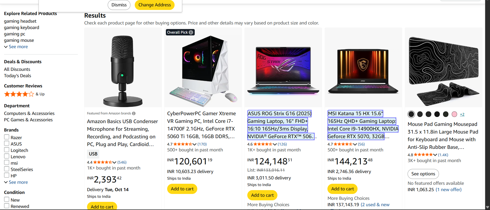

# Exercise 5: Web Scraping Data
## Objective:

Use UiPath to scrape data from a website (such as product listings or news headlines) and save it to a CSV file.

## Pre-requisites:

A basic understanding of how to use UiPath Studio

Internet connection

Google Chrome or Edge browser installed with the UiPath Web Automation extension enabled

## Step-by-Step Instructions:
### 1. Create a New UiPath Project

Open UiPath Studio.

Click New Project > Process.

Name it: WebScrapingDemo.

Set a save location and click Create.

### 2. Select a Website to Scrape

For this example, we’ll scrape data from the site: https://amazon.com

### 3. Open the Website in Browser

Open Chrome or Edge.

Navigate to https://amazon.com

Leave it open.

### 4. Use Data Scraping Wizard

In UiPath Studio, open Main.xaml.

Go to the Design tab and click Data Scraping.

Click Next, then click on a product title on the webpage.

When prompted to select a similar element, click the second product title.

Click Yes to extract correlated data.

Select the price of the first and second product.

Click Finish to generate the Data Scraping sequence.

### 5. Save Scraped Data to CSV

After the ExtractDataTable activity is created, drag Write CSV below it.

Set Input: ExtractDataTable

Set File Path: "C:\Users\saisa\OneDrive\Documents\UiPath\web-scraping"

Check Add Headers.

### 6. Run the Automation

Save the workflow (Ctrl + S).

Run the bot.

Check the file path for webscrap.csv.

## OUTPUT

After running the automation, the scraped data will be saved in webscrap.csv. Example:

ASUS ROG Strix G16 - "INR124,148"

MSI Katana 15 "INR144,213"

## RESULT 
thus , the web scraping and saving it as csv file is executed successfully using UiPath.
